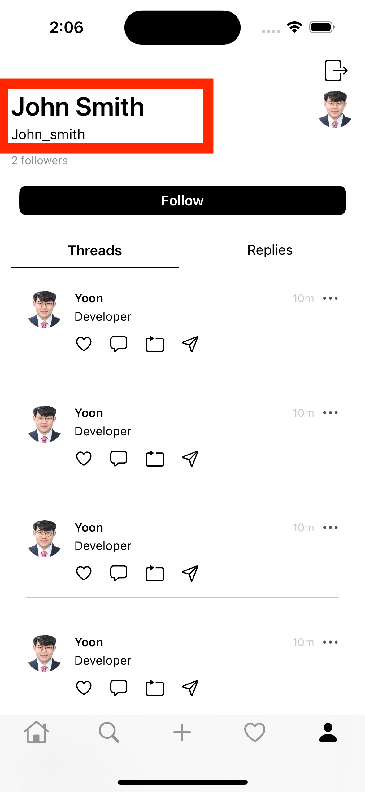
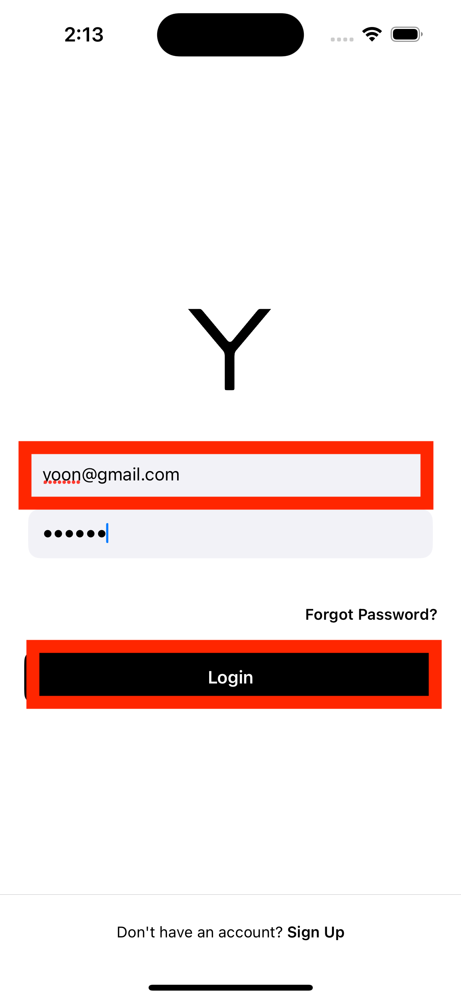

# Tech Stack
- **UI**: SwiftUI
- **Backend**: Firebase (Firestore, Authentication, Storage)
- **Architecture**: MVVM
- **Library**: Kingfisher, Combine 

# ScreenShots

    
    

    
    

    
    
    

    
    

    
    

    
    

    
    
    

    
    
    
    

    
    

    
    

    

## Update Profile with the information of the logged-in user
<!-- User: yoon , User: john login and profile view fetching Firebase -->

    
    

    
    

## Navigation from Explore View to Profile View

    
    

## GuestUser Profile View    VS   Logged-in User Profile View

    
    

## Edit My Profile Photo Image

    
    

    
    

    
        

    
    

## Post New Thread Feature

    

